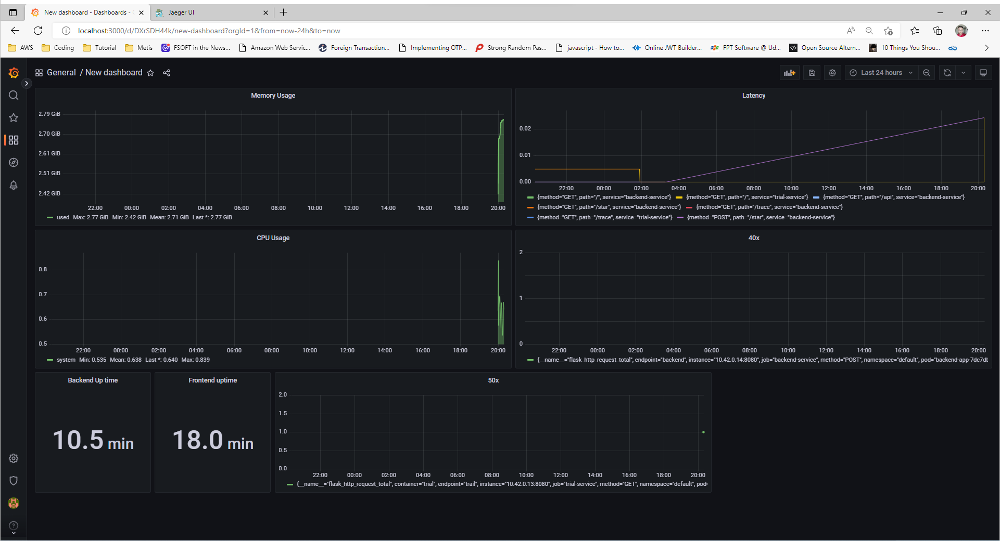

**Note:** For the screenshots, you can store all of your answer images in the `answer-img` directory.

## Verify the monitoring installation

*DONE:* run `kubectl` command to show the running pods and services for all components. Take a screenshot of the output and include it here to verify the installation

## Setup the Jaeger and Prometheus source
*DONE:* Expose Grafana to the internet and then setup Prometheus as a data source. Provide a screenshot of the home page after logging into Grafana.

## Create a Basic Dashboard
*DONE:* Create a dashboard in Grafana that shows Prometheus as a source. Take a screenshot and include it here.

## Describe SLO/SLI
*DONE:* Describe, in your own words, what the SLIs are, based on an SLO of *monthly uptime* and *request response time*.
- SLIs is actual meassurement of SLO. In case of SLO *monthly uptime* and *request response time*. We can have these following SLI
    - The average of API latency during this month was 194 ms.
    - Uptime of this month achieved 99.5%

## Creating SLI metrics.
*DONE:* It is important to know why we want to measure certain metrics for our customer. Describe in detail 5 metrics to measure these SLIs. 

    Latency — The time taken to serve a request (usually measured in ms).

    Traffic — The amount of stress on a system from demand (such as the number of HTTP requests/second).

    Errors — The number of requests that are failing (such as number of HTTP 500 responses).

    Saturation — The overall capacity of a service (such as the percentage of memory or CPU used).

    Success — The number of requests that are success (such as number of HTTP 2xx responses).

The first 4 metrics is from *Four Golden Signals*

## Create a Dashboard to measure our SLIs
*DONE:* Create a dashboard to measure the uptime of the frontend and backend services We will also want to measure to measure 40x and 50x errors. Create a dashboard that show these values over a 24 hour period and take a screenshot.

## Tracing our Flask App
*DONE:*  We will create a Jaeger span to measure the processes on the backend. Once you fill in the span, provide a screenshot of it here. Also provide a (screenshot) sample Python file containing a trace and span code used to perform Jaeger traces on the backend service.

## Jaeger in Dashboards
*DONE:* Now that the trace is running, let's add the metric to our current Grafana dashboard. Once this is completed, provide a screenshot of it here.

## Report Error
*TODO:* Using the template below, write a trouble ticket for the developers, to explain the errors that you are seeing (400, 500, latency) and to let them know the file that is causing the issue also include a screenshot of the tracer span to demonstrate how we can user a tracer to locate errors easily.

TROUBLE TICKET

Name: Get trial home page 500 error code

Date: 09/30/2022

Subject: Template not found

Affected Area: home page api of trial service

Severity: High

Description: Request the home page trial service but the template not found

## Creating SLIs and SLOs
*DONE:* We want to create an SLO guaranteeing that our application has a 99.95% uptime per month. Name four SLIs that you would use to measure the success of this SLO.

    Latency — The time taken to serve a request (usually measured in ms).

    Traffic — The amount of stress on a system from demand (such as the number of HTTP requests/second).

    Errors — The number of requests that are failing (such as number of HTTP 500 responses).

    Saturation — The overall capacity of a service (such as the percentage of memory or CPU used).

## Building KPIs for our plan
*DONE*: Now that we have our SLIs and SLOs, create a list of 2-3 KPIs to accurately measure these metrics as well as a description of why those KPIs were chosen. We will make a dashboard for this, but first write them down here.

- CPU Utilization less than 50%
- Memory Utilization less than 70%
- Backend API request/response time should be under 100ms

## Final Dashboard
*DONE*: Create a Dashboard containing graphs that capture all the metrics of your KPIs and adequately representing your SLIs and SLOs. Include a screenshot of the dashboard here, and write a text description of what graphs are represented in the dashboard.  

